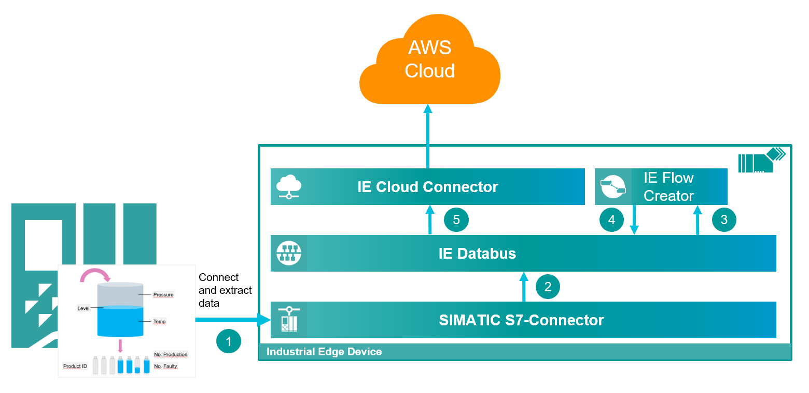
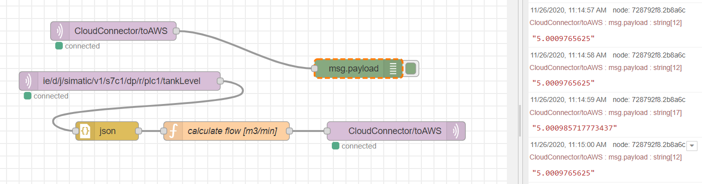

# IoT gateway

Using the Industrial Edge system apps to preprocess PLC data and push it to the cloud

- [IoT gateway](#iot-gateway)
  - [Description](#description)
    - [Overview](#overview)
    - [General task](#general-task)
  - [Requirements](#requirements)
    - [Used components](#used-components)
    - [Further requirements](#further-requirements)
    - [TIA Project](#tia-project)
  - [Installation](#installation)
  - [Usage](#usage)
  - [Documentation](#documentation)
  - [Contribution](#contribution)
  - [Licence and Legal Information](#licence-and-legal-information)
  - [Disclaimer](#disclaimer)

## Description

This example demonstrates how to use the Industrial Edge System Apps to read data from a PLC, preprocess it and push it to the cloud

### Overview

  
   

The OPC UA Connector is used to read status data from the PLC in a 100ms cycle and publishes it to the Databus
The Flow Creator is used to read the data and calculate the flow in m3/min and publish it back to the Databus
The Cloud Connector then reads this preprocessed data and publishes it to the AWS Cloud.

### General task

To set up this example, the Databus, the OPC UA Connector and the Cloud Connector have to be configured.

## Requirements

### Used components

- Industrial Edge Management (IEM) V1.5.2-4 / V1.11.8
  - Databus Configurator V2.0.0-5
  - Common Connector Configurator V1.8.1-4
- Industrial Edge Device (IED) V1.10.0-9
  - Databus V2.0.0-4
  - OPC UA Connector V1.8.1
- Cloud Connector V1.9.3-1
- Data Service V 1.6.0
- Flow Creator V 1.12.0-1
- PLC: CPU 1511 FW 2.8.3

### Further requirements

- The Bottle filling example project is loaded to a PLC on which a OPC-UA server is running.
- The minimum publishing interval and sampling interval of the OPC UA server of the PLC is set to 100ms
- OPC UA Connector is installed on the Industrial Edge Device (IED)
- Cloud Connector is installed on the IED
- Flow Creator is installed on the IED
- Access to AWS with permission to create IoT Devices and policies

### TIA Project

The used TIA Portal project can be found in the [miscellaneous repository](https://github.com/industrial-edge/miscellaneous) in the tank application folder and is also used for several further application examples:

- [Tia Tank Application](https://github.com/industrial-edge/miscellaneous/tree/main/tank%20application)

## Installation

Please refer to the [Installation](./docs/Installation.md) documentation

## Usage

To publish preprocessed data of the PLC to the cloud, the Flow Creator is used to receive the data published to the Databus by the OPC UA Connector, preprocess it and publish the result to the topic the Cloud Connector is listening to.

In the bottle filling and the following flow, the filling level of the tank is used to calculate the flowrate of the tank filling which is then published to the AWS IoT thing.
Configure the Industrial Edge System Applications according to the [Installation](./docs/Installation.md) documentation and deploy the provided [flow](./src/iotGateway-flow.json) into the Flow creator. Before deploying the flow enter the user credentials configured in Databus in the MQTT-Node.

Start the flow and the PLC Program. The calculated flowrate is now visible in the aws IoT management console:

You can find the flow [here](./src/iotGateway-flow.json)

## Documentation

- You can find further documentation and help in the following links
  - [Industrial Edge Hub]( https://iehub.eu1.edge.siemens.cloud/#/documentation)
  - [Industrial Edge Forum]( https://forum.mendix.com/link/space/industrial-edge)
  - [Industrial Edge landing page]( https://new.siemens.com/global/en/products/automation/topic-areas/industrial-edge/simatic-edge.html)
  - [Industrial Edge GitHub page]( https://github.com/industrial-edge)
  - [Industrial Edge documentation page]( https://docs.eu1.edge.siemens.cloud/index.html)
 
## Contribution
 
Thank you for your interest in contributing. Anybody is free to report bugs, unclear documentation, and other problems regarding this repository in the Issues section.
Additionally everybody is free to propose any changes to this repository using Pull Requests.
 
If you are interested in contributing via Pull Request, please check the [Contribution License Agreement](Siemens_CLA_1.1.pdf) and forward a signed copy to [industrialedge.industry@siemens.com](mailto:industrialedge.industry@siemens.com?subject=CLA%20Agreement%20Industrial-Edge).
 
## License and Legal Information
 
Please read the [Legal information](LICENSE.txt).
 
## Disclaimer
 
IMPORTANT - PLEASE READ CAREFULLY:
 
This documentation describes how you can download and set up containers which consist of or contain third-party software. By following this documentation you agree that using such third-party software is done at your own discretion and risk. No advice or information, whether oral or written, obtained by you from us or from this documentation shall create any warranty for the third-party software. Additionally, by following these descriptions or using the contents of this documentation, you agree that you are responsible for complying with all third party licenses applicable to such third-party software. All product names, logos, and brands are property of their respective owners. All third-party company, product and service names used in this documentation are for identification purposes only. Use of these names, logos, and brands does not imply endorsement.
