# Installation

- [Installation](#installation)
  - [Setting up the Databus](#setting-up-the-databus)
  - [Setting up the OPC UA Connector](#setting-up-the-opc-ua-connector)
  - [Setting up the Connection to the cloud](#setting-up-the-connection-to-the-cloud)
    - [Creating a new policy and thing for the AWS IoT device](#creating-a-new-policy-and-thing-for-the-aws-iot-device)
    - [Setting up the Cloud Connector](#setting-up-the-cloud-connector)
    - [Testing the Connection to the cloud](#testing-the-connection-to-the-cloud)

## Setting up the Databus

In this example, two topics on the Databus are used.

- `ie/d/j/simatic/v1/opcuac1/dp/r/plc1/default` (example name) This topic is used by the OPC UA Connector to publish the data read from the PLC.
- `CloudConnector/toAWS` (example name) This topic is used by the Cloud Connector to receive data which will then be published to the cloud.

To set up a user with publish and subscribe permission, open the Databus Configurator for your device and set it up accordingly. In this example, a user `edge` has permission to publish and subscribe to `ie/#` and `CloudConnector/#`:

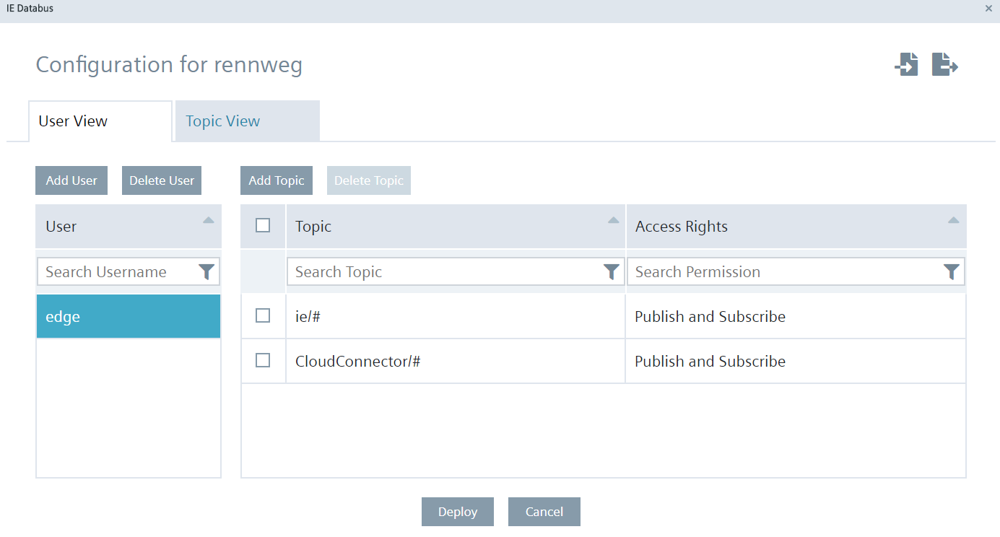

## Setting up the OPC UA Connector

- Open the OPC UA Connector Configurator.
- Go to settings and enter your databus credentials.

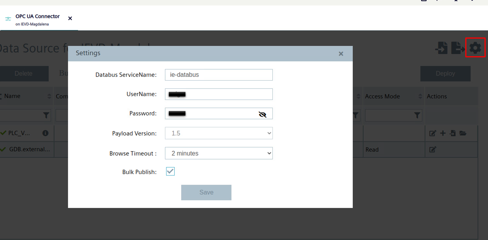

- Add your PLC as a data source *Important*: The choosen name (here: plc1) corresponds to the first topic name you will listen to. Remember to change the topicname correspondingly, otherwise you will not recieve the data (*ie/d/j/simatic/v1/opcuac1/dp/r/**plc1**/default*).
- Browse the tags and select  `GDB.externalSignals.tankSignals.actLevel` with a 100ms acquisition cycle (change this in the oper left corner).
- Check the tag and press *deploy*.

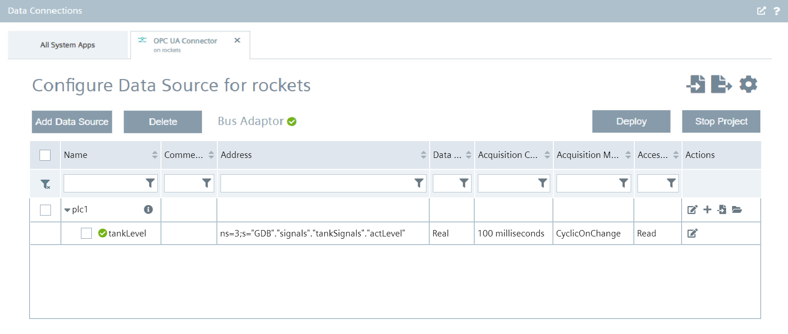

## Setting up the Connection to the cloud

Before starting the Cloud Connector Configurator, a new policy and a new device have to be set up in the AWS IoT management console.

### Creating a new policy and thing for the AWS IoT device

To open the AWS IoT management console search for *IoT Device Management* and open it:

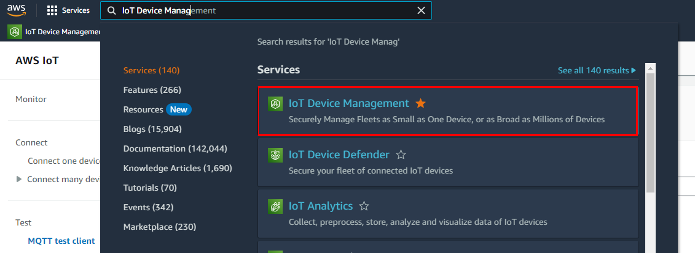

In the AWS IoT management console follow these steps:

- Navigate to "Manage" -> "All devices" -> "Things"
- Click on "Create things"
- Select "Create single thing" and then click "Next"

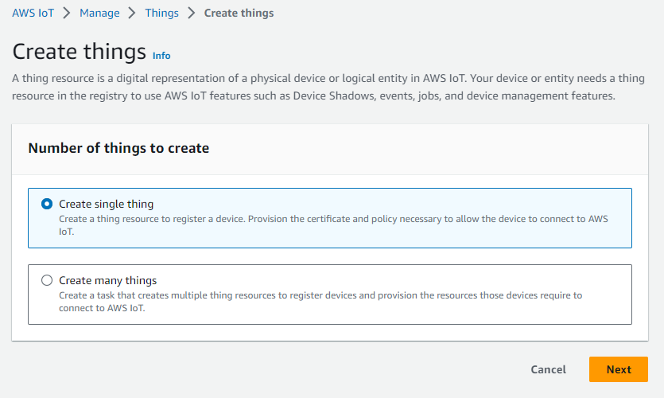

- Enter the Thing name

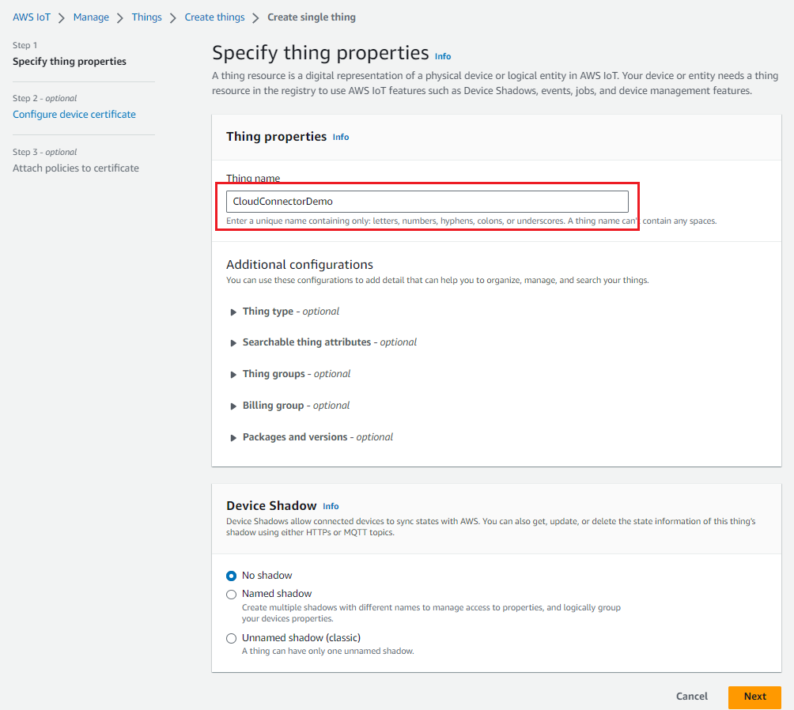

- Select "Auto-generate a new certificate (recommended)" and then click "Next"

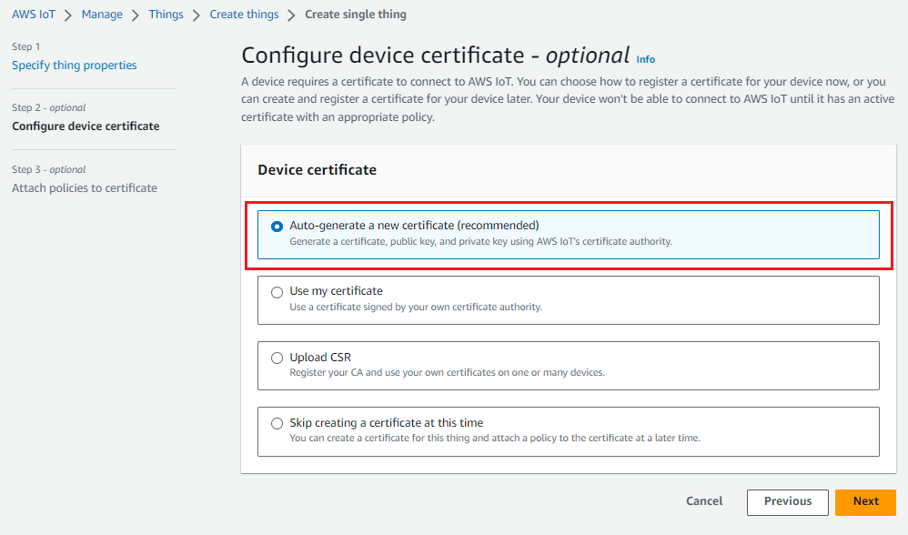

- Click on "Create policy"
- Enter the Policy name
- In the "Policy action" box choose an action one by one for `iot:Publish, iot:Connect`
- In the "Policy resource" box enter the character "*"
- In the "Policy effect" box check to "Allow"
- Click "Create"

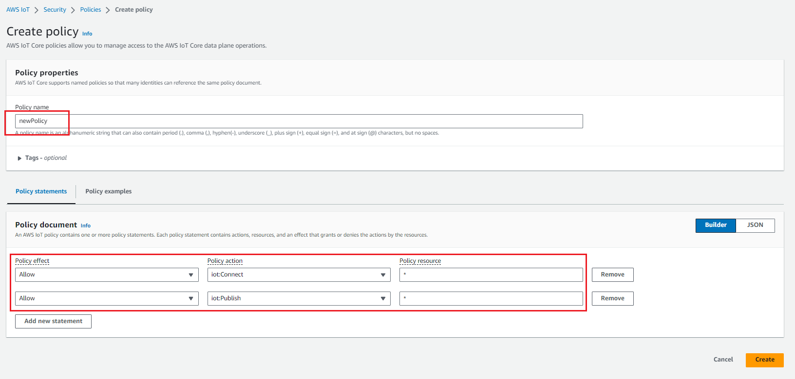

- Check the policy created and then click "Create thing"

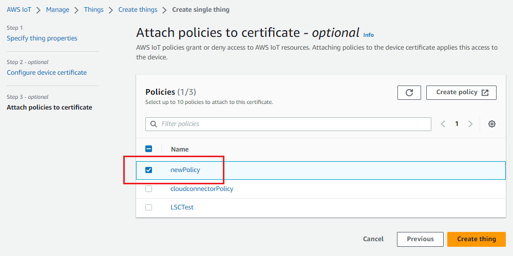

- Download the certificate and private key

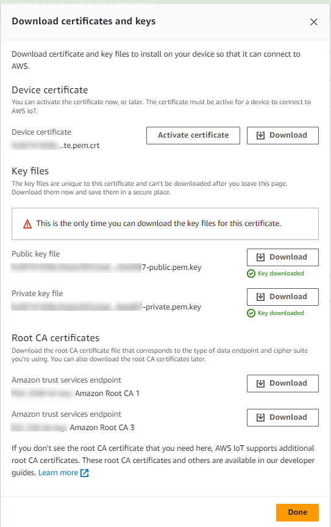

The thing has been registered successfully. Keep the certificate and private key for the Cloud Connector Configuration.

### Setting up the Cloud Connector

Now that an IoT device was created in the AWS cloud, the Cloud Connector can be set up.

Configure the Cloud Connector for Edge Management Data Connection

- Go to: Adapters -> Click *Add Topic*
- Check *User-defined Topic*
- Enter your HostName: `ie-databus`, Port Number: `1883`, Username: `edge`, Password: `edge`
- The Subscription topic is the topic to which the Cloud Connector will subscribe to listen for data to publish to the cloud. E.g. `CloudConnector/#` . This means the Cloud Connector can subscribe to all topics starting with `CloudConnector/`.
- Click "Add Topic" and enter a topic name, e.g `CloudConnector/toAWS` and click save. This topic must start with the name configured in the previous step.

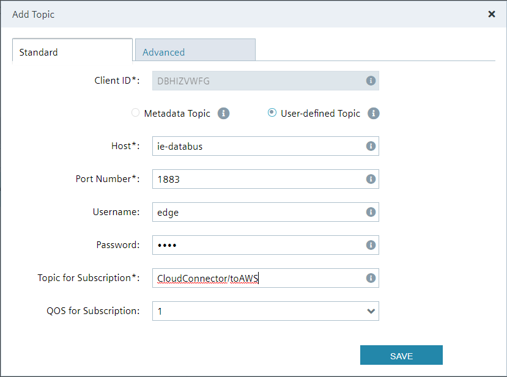

- Click on Add Route 
- Enter a name for the route `toAWS`

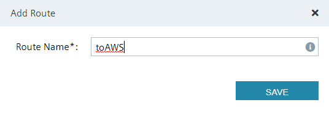

The last part is to configure the cloud clients

- Click on "Add Client"
- Enter a Name e.g `ccID` and choose `AWS` as type and click "save"
- Select the certificate and private key you downloaded when creating the AWS thing
- Click on the edit symbol net to the client
- Enter a Client ID e.g `ccID`. This will be the ID used by the connector to publish data to the MQTT broker of the AWS IoT device.
- Enter the hostname of the AWS endpoint. You can find the address at the "Settings" section of the AWS IoT console. It looks similar to this: `abcdefghi12345.iot.us-east.amazonaws.com`
- Enter `8883` as Port Number
- Enter Proxy settings if needed

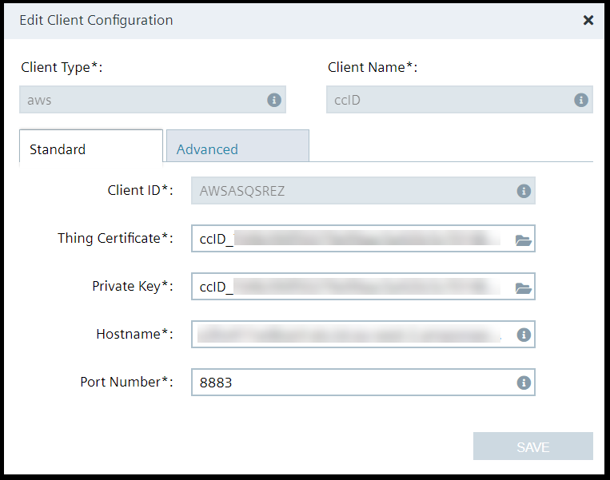
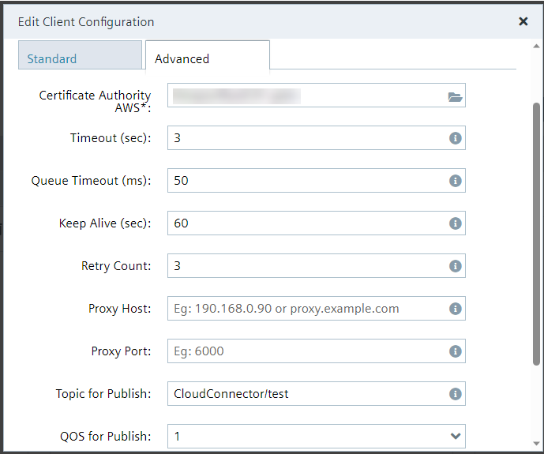

- Now select the route, check the box next to the bus adaptor topic `CloudConnector/toAWS` and check the box next to Cloud Connector Clients `ccID`.
- Click "save Route" and "Deploy"

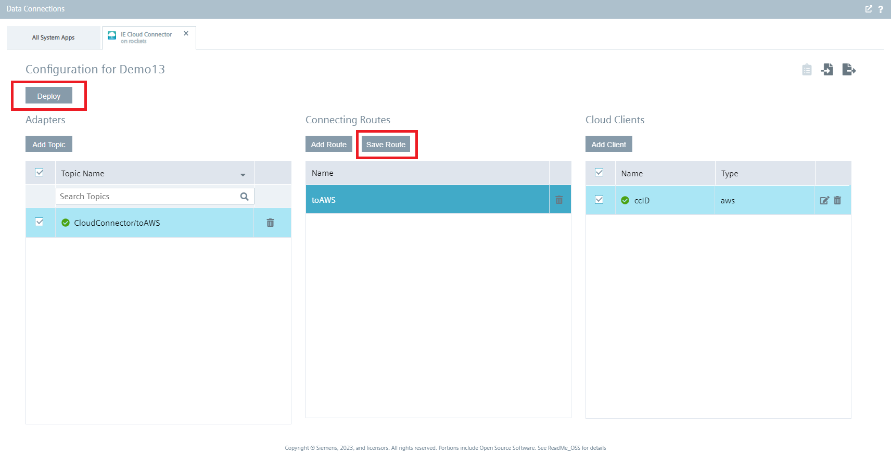

Now every data published to the bus adaptor topic of the Databus will get published to the AWS Cloud.
E.g. data published to the topic `CloudConnectot/toAWS` in the Databus will get published to the topic `CloudConnector/test` of the AWS IoT thing. The publish topic to which the Cloud Connector will publish the data in the AWS Cloud is set in the "Advanced" Tab of the Cloud Connector Client settings, the default value is `CloudConnector/test`

### Testing the Connection to the cloud

In the AWS IoT management console:

- Navigate to "Test" -> "MQTT test client"
- In "Subscribe to a topic" enter the topic the Cloud Connector is publishing to. E.g. `CloudConnector/#`
- Open the Flow Creator an publish some test data to the topic the Cloud Connector is subscribing to. E.g. `CloudConnector/toAWS`
- The data will be visible in the IoT management console

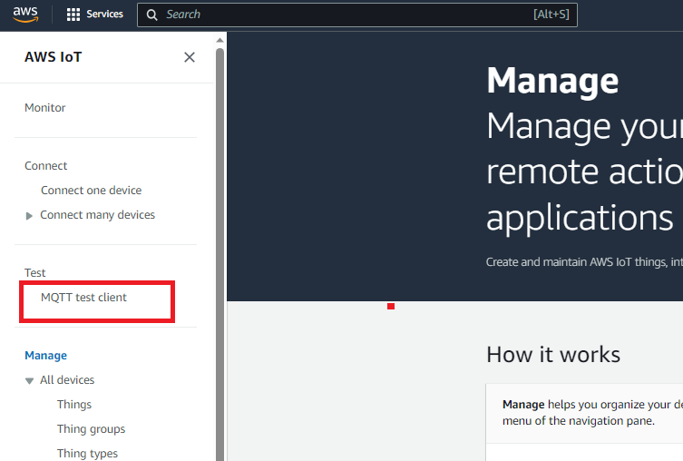

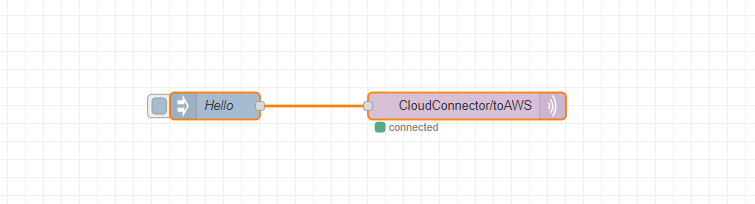

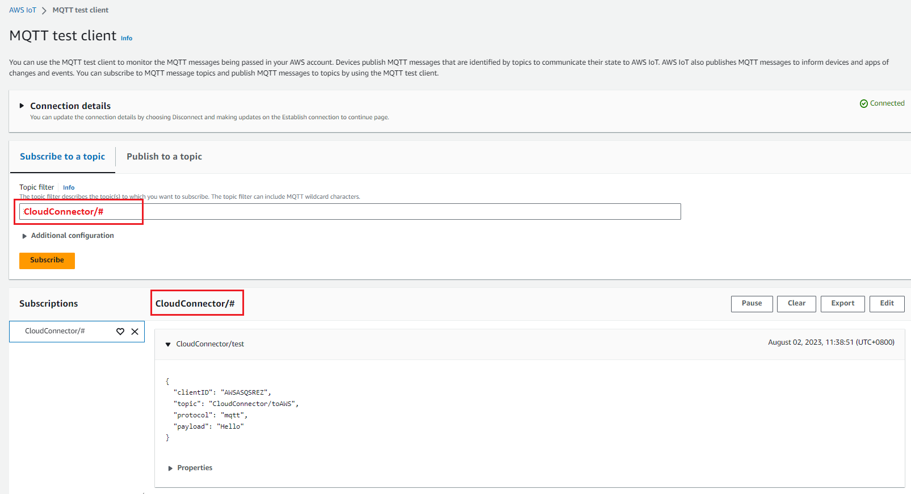